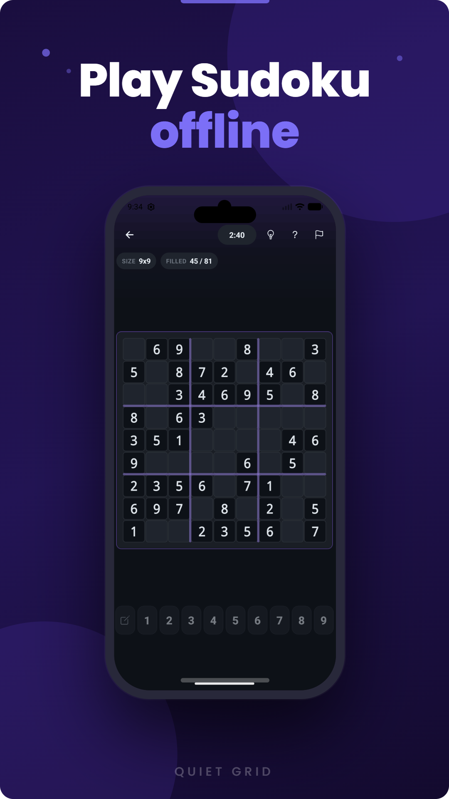
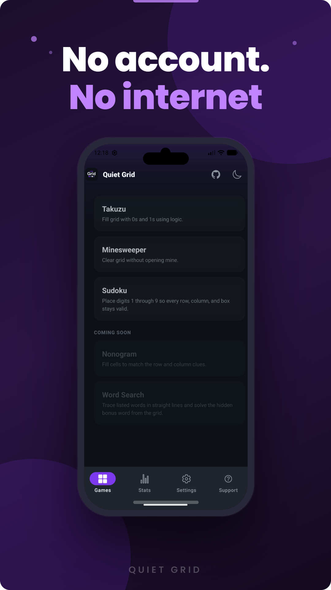
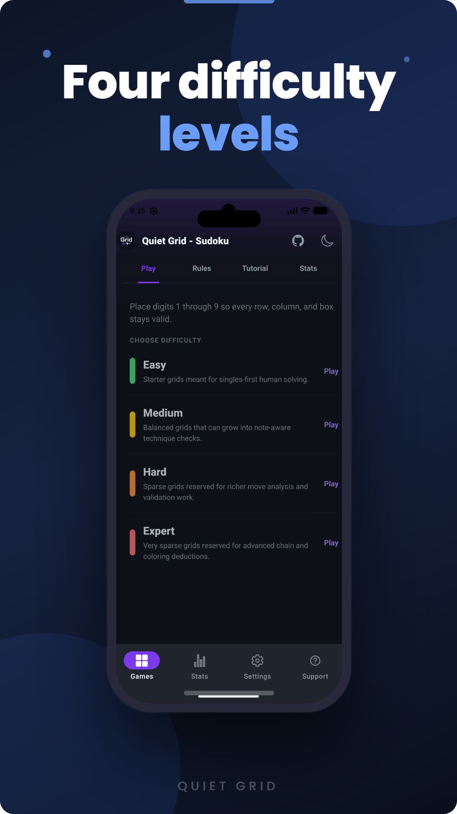
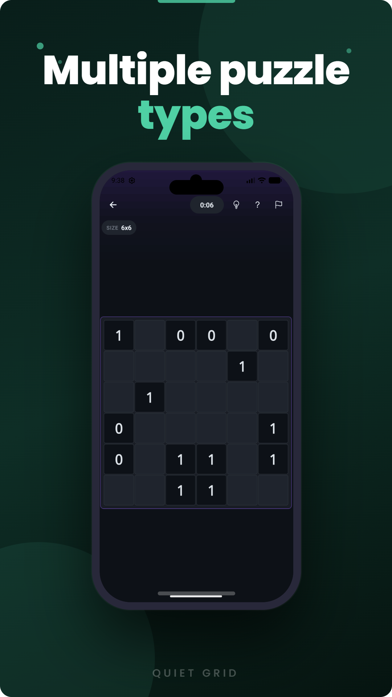

# Quiet Grid

<a href="https://play.google.com/store/apps/details?id=com.quietgrid.app">
  
</a>

A privacy-first logic puzzle app for Android, built with React Native (Expo) and TypeScript.

No ads. No account. No internet required. Everything stays on your device.






## Puzzles

| Game | Status |
| --- | --- |
| Takuzu | Available |
| Minesweeper | Available |
| Nonogram | Beta |
| Sudoku | Available |
| Word Search | Beta |
| Chimp Test | Available |

Each puzzle type has Easy, Medium, Hard, and Expert difficulty levels.

## Languages

English, Dutch, German, French, Spanish.

## Getting Started

### Requirements

- Node.js 18+
- Android emulator via [Android Studio](https://developer.android.com/studio), or a physical Android device with [Expo Go](https://expo.dev/client)

> Android only. iOS and web are not supported.

### Install and run

```bash
npm install
npm run android
```

## Generating puzzles

Puzzle catalogs are generated offline using a CLI in `src/engine/`. Game-owned engine plugins live in `src/games/<id>/engine/` and append to `src/games/<id>/puzzles/all.ts`. A local SQLite file (`src/engine/puzzles.db`, gitignored) tracks seen puzzles to avoid duplicates.

```bash
npm run engine -- --game=takuzu
npm run engine -- --game=takuzu --size=8
npm run engine -- --game=nonogram
npm run engine -- --game=nonogram --size=5 --difficulty=easy 25
```

## Privacy

All data is stored on-device. No network requests are made. See [PRIVACY.md](PRIVACY.md).

## License

[GNU General Public License v3.0](LICENSE)
