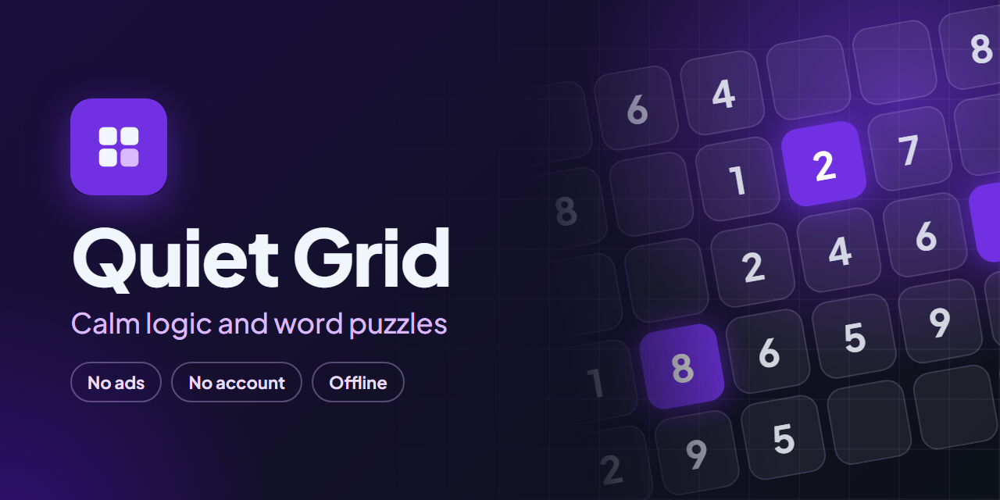
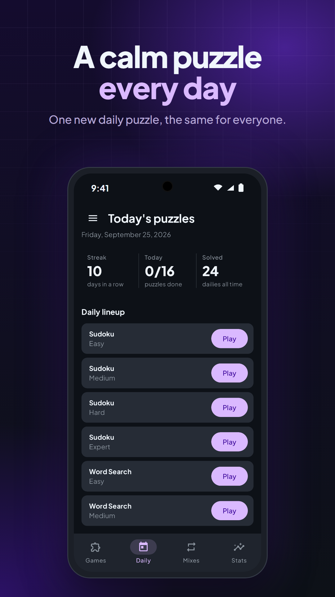
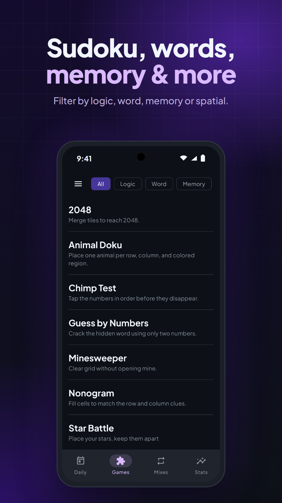
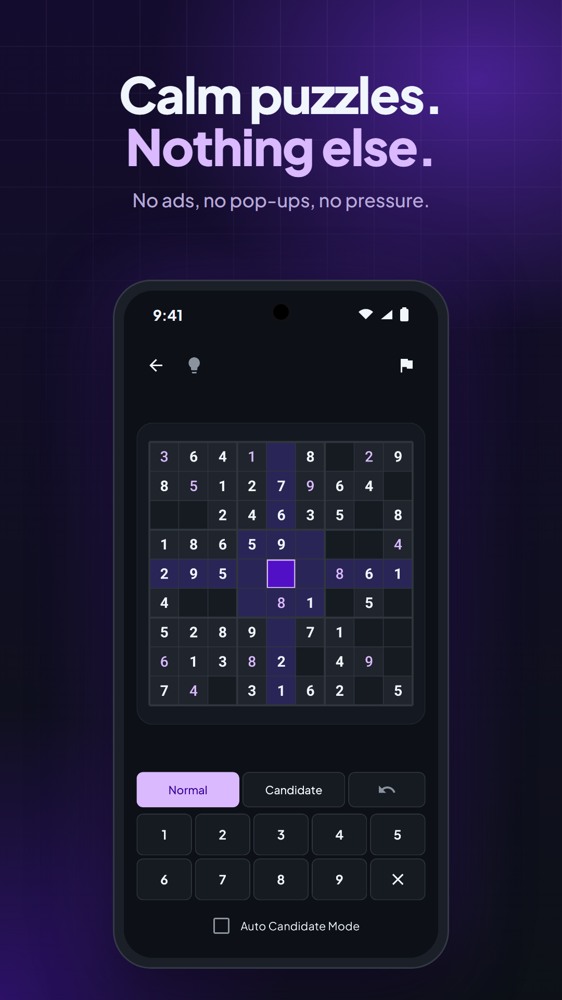
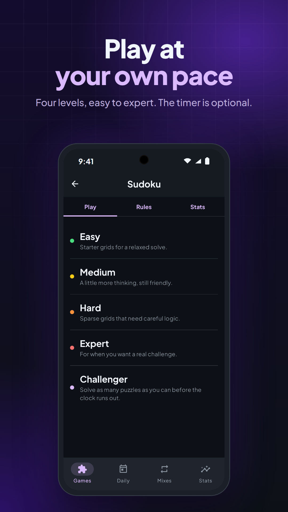

<b>Calm logic and word puzzles for Android. No ads, no account, no internet.</b>

  
  
  
  
  

  
  

Also on <a href="https://github.com/lendl/quiet-grid/releases/latest">GitHub Releases</a> · <a href="https://apps.obtainium.imranr.dev/redirect?r=obtainium://add/https://github.com/lendl/quiet-grid">Obtainium</a> · <a href="https://apkpure.com/p/com.quietgrid.app">APKPure</a>

  
  
  
  

<a href="#features">Features</a> · <a href="#privacy">Privacy</a> · <a href="#download">Download</a> · <a href="docs/DEVELOPMENT.md">Development</a>

## Features

### Logic

- **Sudoku** — Place digits 1 through 9 so every row, column, and box stays valid.
- **Takuzu** — Fill grid with 0s and 1s using logic.
- **Nonogram** — Fill cells to match the row and column clues.
- **Minesweeper** — Clear grid without opening mine.
- **Animal Doku** — Place one animal per row, column, and colored region.
- **Star Battle** — Place your stars, keep them apart.

### Word

- **Word Search** — Trace listed words in straight lines and solve the hidden bonus word from the grid.
- **Word Guess** — Guess the hidden word in six tries.
- **Guess by Numbers** — Crack the hidden word using only two numbers.

### Memory

- **Chimp Test** — Tap the numbers in order before they disappear.

### Spatial

- **2048** — Merge tiles to reach 2048.

In beta, enable in Settings: Arrow Escape, Block Fill, N-Back.

### Also

- Daily puzzle with reminders; puzzle mixes; four difficulty levels
- Seven themes incl. colorblind-friendly Pencil; optional timer
- Languages: English, Dutch, German, French, Spanish, Portuguese, Polish

## Privacy

> Quiet Grid makes no network requests — the app has no INTERNET permission. The only permissions it requests are `POST_NOTIFICATIONS` (for optional daily puzzle reminders) and `VIBRATE` (for haptic feedback). No analytics, no crash reporting, no accounts. Everything — puzzle progress, stats, and settings — stays on your device. See [PRIVACY.md](PRIVACY.md).

## Download

| Source | Link |
| --- | --- |
| F-Droid | <https://f-droid.org/en/packages/com.quietgrid.app/> |
| Google Play | <https://play.google.com/store/apps/details?id=com.quietgrid.app> |
| GitHub Releases | <https://github.com/lendl/quiet-grid/releases/latest> |
| Obtainium | <https://apps.obtainium.imranr.dev/redirect?r=obtainium://add/https://github.com/lendl/quiet-grid> |
| APKPure | <https://apkpure.com/p/com.quietgrid.app> |

## Development

Built natively with Kotlin and Jetpack Compose. See [`docs/DEVELOPMENT.md`](docs/DEVELOPMENT.md) for build setup and puzzle generation.

## License

[GNU General Public License v3.0](LICENSE)
